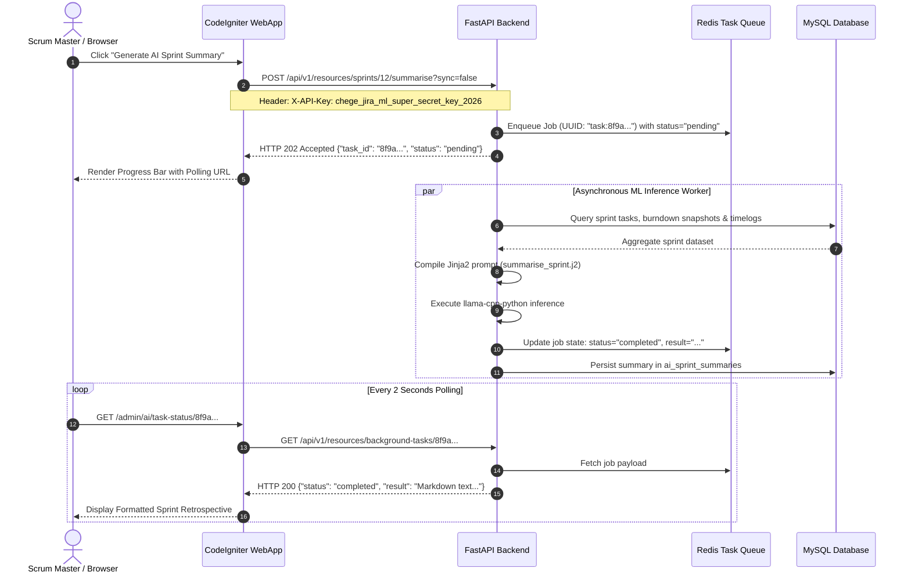
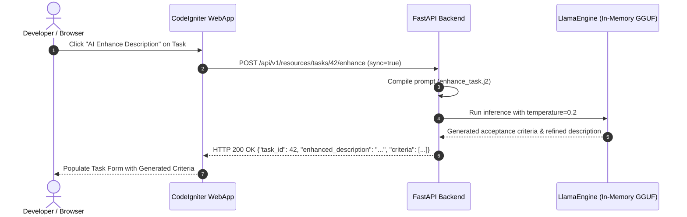

# Communication & Networking Protocols

This document specifies inter-service communication protocols, payload formats, authentication handshakes, and network flows across the suite.

---

## 🌐 Communication Matrix

| Source Service | Target Service | Transport | Auth Mechanism | Dev Base URL | Notes |
| :--- | :--- | :--- | :--- | :--- | :--- |
| **Browser Client** | `chege-jira-webapp` | HTTP/HTTPS | Cookie Session + CSRF Token | `http://localhost:80` | Interactive web dashboard and AJAX APIs |
| **External Integrator** | `ml-chege-jira` | HTTP REST | `X-API-Key` or Bearer Token | `http://localhost:8000` | Direct Swagger API testing and ML telemetry |
| **WebApp** | `ml-chege-jira` | HTTP REST (JSON) | `X-API-Key` Header | `http://ml-chege-jira:8000` | Inter-service calls from `LlmService.php` |
| **WebApp** | `shared-redis` | Redis TCP Socket | None (Internal Network) | `redis:6379` | 50ms pre-flight socket probe; session & cache |
| **WebApp** | `shared-mysql` | MySQL Protocol | Password Credentials | `mysql:3306` | CodeIgniter relational queries |
| **ML Backend** | `shared-mysql` | Async MySQL Protocol | Password Credentials | `mysql:3306` | Async SQLAlchemy queries for entity extraction |
| **ML Backend** | `shared-redis` | Redis TCP Socket | None (Internal Network) | `redis://redis:6379/0` | Async task state & job tracking |

---

## 🔄 Interaction Sequences

### 1. User Authentication & Resilient Session Establishment

```mermaid
sequenceDiagram
    autonumber
    actor User as Web Browser
    participant Nginx as Nginx Web Server
    participant CI as CodeIgniter 4 WebApp
    participant Resilient as ResilientSessionHandler
    participant Redis as Redis 7 (In-Memory)
    participant MySQL as MySQL 8.4 (ci_sessions)

    User->>Nginx: POST /login {username, password, csrf_token}
    Nginx->>CI: Forward Request
    CI->>CI: Verify CSRF & Validate Password Hash
    CI->>Resilient: Initialize Session (write session id)
    Resilient->>Redis: 50ms Socket Probe (@fsockopen)
    
    alt Redis is Online (<= 50ms)
        Redis-->>Resilient: Socket Connected
        Resilient->>Redis: SETEX chege_jira_session:...
        Resilient-->>CI: Session Stored in Redis RAM (< 1ms)
    else Redis Offline or Degraded
        Resilient-->>Resilient: Fallback Activated
        Resilient->>MySQL: INSERT INTO ci_sessions (id, data, timestamp)
        Resilient-->>CI: Session Stored in MySQL (2-5ms)
    end

    CI-->>Nginx: Set-Cookie: ci_session=...; HttpOnly; SameSite=Lax
    Nginx-->>User: HTTP 302 Redirect to /dashboard
```

---

### 2. Asynchronous Sprint Retrospective Generation



---

### 3. Synchronous Task Enhancement



---

## 📐 API Versioning & Error Convention

### Versioning
All REST endpoints exposed by the ML microservice are prefixed with `/api/v1`. Breaking changes require a distinct version namespace (`/api/v2`).

### Error Response Schema
All error responses return standard JSON bodies:
```json
{
  "detail": {
    "error_code": "MODEL_NOT_LOADED",
    "message": "No active GGUF model is currently loaded in memory.",
    "resolution": "Execute POST /api/v1/models/load with an available model name."
  }
}
```
