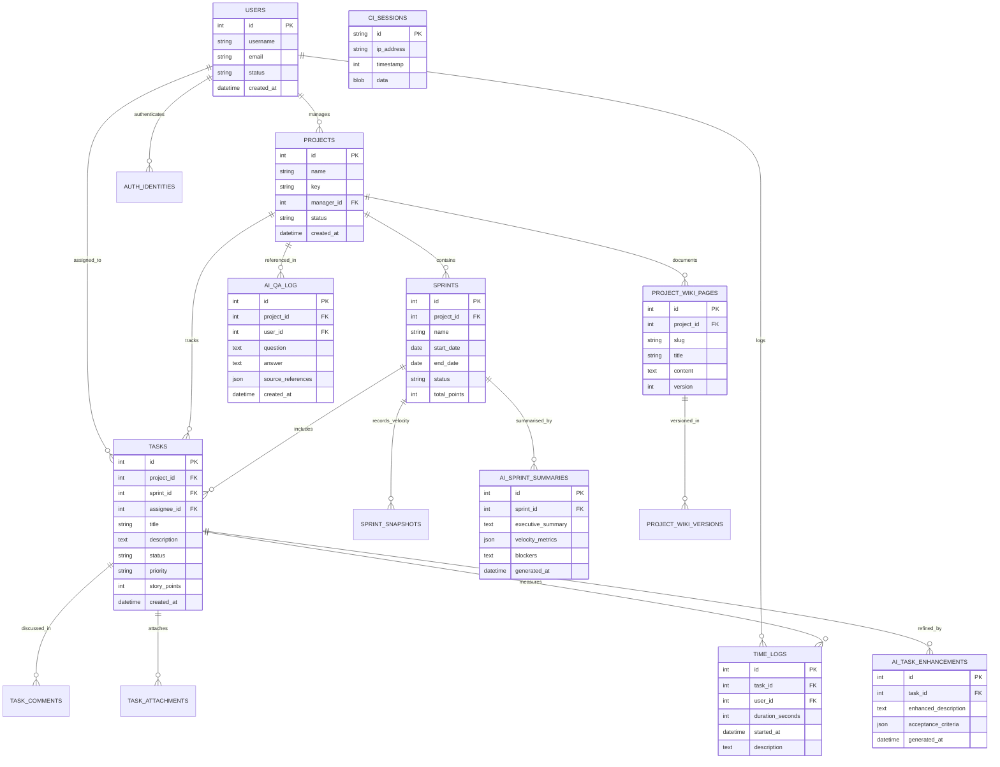

# Data & Storage Architecture

This document specifies data persistence, relational schemas, in-memory caching strategies, and file storage for the unified platform.

---

## 🗄 Relational Storage: MySQL 8.4

The central relational database is named `db_chege_jira` and managed by MySQL 8.4 LTS.

### 1. Volume Persistence
Data is preserved inside the named Docker volume `mysql-data`:
- **Container Path:** `/var/lib/mysql`
- **Engine:** InnoDB with `utf8mb4_unicode_ci` collation
- **SQL Mode:** Strict transactional tables (`STRICT_TRANS_TABLES,NO_ZERO_IN_DATE...`)

---

## 📊 Entity-Relationship Diagram (ERD)

The diagram below reflects the relational database schema defined by the 33 versioned migrations in `services/web/app/Database/Migrations/`:

---

## ⚡ In-Memory Storage: Redis 7

Redis handles high-throughput volatile operations and asynchronous coordination:

1. **User Sessions:**
   - Keys: `chege_jira_session*` / `ci_session*`
   - Primary driver for CodeIgniter 4. Falls back to MySQL `ci_sessions` table if Redis is temporarily offline.
2. **ML Background Tasks:**
   - Keys: `task:<uuid>` (TTL: 86,400s)
   - Stores task payload, status (`pending`, `processing`, `completed`, `failed`), progress percentage, and output text.
3. **Application Cache:**
   - Application telemetry vitals, active model catalog, and pre-computed dashboard metrics.
4. **Volume Persistence:**
   - Bound to `redis-data:/data` with Append-Only File (`AOF`) logging enabled (`--appendonly yes`).

---

## 📁 File System & Artifact Storage

1. **GGUF Models Directory:**
   - Path: `services/ml/models/` mounted to `/app/models:rw`.
   - Models are binary weight files (`*.gguf`) and are explicitly ignored by Git.
   - Pre-loaded models like `phi3-mini` (2.2 GB) or `mistral-7b` (4.1 GB) reside here.
2. **Web Uploads:**
   - Path: `services/web/writable/uploads/`
   - Preserves user avatars and project attachments.
3. **Database Backups:**
   - Path: `services/web/writable/backups/`
   - Stores compressed database archives created by `php spark db:backup`.
