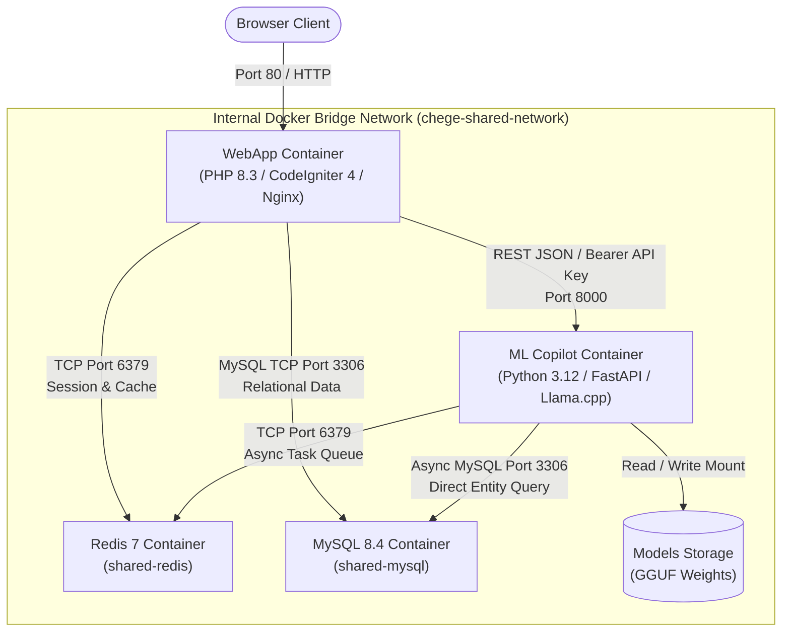

# System Architecture Overview

The **AI-Agile-Project-Management-Suite** is a unified full-stack monorepo delivering enterprise agile project management with an on-premise local LLM copilot.

---

## 🏗 High-Level Component Topology



---

## 📦 Monorepo Directory Architecture

```text
AI-Agile-Project-Management-Suite/
├── docker-compose.yml          # Root stack orchestrator
├── .env.example                # Unified environment variables
├── Makefile                    # Developer shortcuts (deploy, up, logs, etc.)
├── scripts/
│   └── deploy.sh               # 13-stage automated one-click deployment
├── docs/                       # Dual-audience engineering documentation
│
└── services/
    ├── web/                    # CodeIgniter 4 WebApp Service
    │   ├── Dockerfile          # Nginx + PHP 8.3-FPM multi-stage
    │   ├── entrypoint.sh       # Auto-migration & seeder bootstrap
    │   ├── app/                # MVC Controllers, Models, Views, Filters
    │   ├── public/             # Static web assets & entrypoint
    │   └── writable/           # Runtime logs, sessions, cache
    │
    └── ml/                     # FastAPI ML Inference Service
        ├── Dockerfile          # Python 3.12 + OpenBLAS + Llama.cpp
        ├── pyproject.toml      # Dependency & package configuration
        ├── app/                # FastAPI routers, prompt templates, core engines
        └── models/             # Local GGUF models repository
```

---

## 🔑 Key Architectural Principles

1. **Strict Port Hardening & Private Network Isolation:**
   - Public host traffic enters exclusively via Port 80 (WebApp) and Port 8000 (ML backend).
   - MySQL (3306) and Redis (6379) are completely private to the internal Docker network. Host ports are unexposed to prevent lateral network penetration and local port collisions.

2. **Unified State & Asynchronous Decoupling:**
   - Both services share the MySQL relational database as the primary source of truth.
   - Long-running LLM inferences (e.g. summarizing a full sprint or deep-analyzing 3 months of timelogs) execute asynchronously in the background via the Redis-backed `TaskManager`.

3. **On-Premise Privacy:**
   - All AI inference executes on CPU/GPU hardware using quantized local GGUF models (`llama-cpp-python`). No proprietary project data or source code ever leaves the server.
