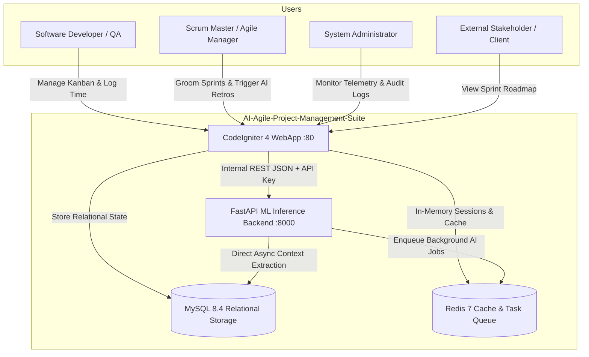
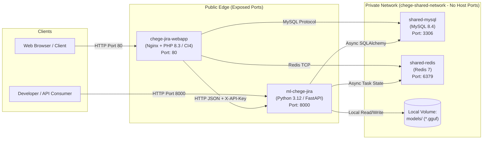

# System Architecture Overview

The **AI-Agile-Project-Management-Suite** is a unified full-stack monorepo delivering an enterprise agile project management platform paired with an on-premise local LLM copilot backend.

---

## 🏛 C4 System Context

---

## 📦 Container Topology & Component Table

All four containers participate in the private Docker bridge network `chege-shared-network`:

### Container Directory & Runtime Mapping

| Container Name | Service Folder | Base Runtime | Exposed Port | Role & Ownership |
| :--- | :--- | :--- | :---: | :--- |
| **`chege-jira-webapp`** | `services/web` | PHP 8.3-FPM + Nginx | `80` (or `$WEB_PORT`) | **Frontend & Business Engine:** Serves HTML/JS, handles user authentication, manages Kanban/Sprints, and owns database migrations. |
| **`ml-chege-jira`** | `services/ml` | Python 3.12 + OpenBLAS | `8000` (or `$ML_PORT`) | **AI Copilot & Worker:** Executes local GGUF models, renders Jinja2 prompts, and manages background AI jobs. |
| **`shared-mysql`** | Built-in Image (`mysql:8.4`) | MySQL 8.4 LTS | `3306` (Internal only) | **Relational Source of Truth:** Stores all agile entities, users, wiki versions, and AI interaction logs. |
| **`shared-redis`** | Built-in Image (`redis:alpine`) | Redis 7 | `6379` (Internal only) | **In-Memory Cache & Job Queue:** Primary session engine for WebApp and async job tracker for ML backend. |

---

## 🛡 Trust Boundaries & Network Isolation

1. **Public Edge Boundary:**
   - Only Ports `80` (WebApp) and `8000` (ML Swagger/API) are bound to the host interface.
   - User browsers communicate exclusively with the WebApp over HTTP/HTTPS with session cookie and CSRF token protection.
2. **Private Microservice Boundary:**
   - The WebApp calls the ML backend across the Docker bridge network `chege-shared-network` using DNS name `http://ml-chege-jira:8000`.
   - Every inter-service request is authenticated by `X-API-Key: chege_jira_ml_super_secret_key_2026`.
3. **Data Isolation Boundary:**
   - Neither MySQL (`3306`) nor Redis (`6379`) publish host ports in `docker-compose.yml`. Host machines cannot reach the database ports directly, protecting against unauthorized access or port collisions.

---

## 📚 Related Documentation
- [Communication & Networking](communication.md)
- [Data & Storage Architecture](data-and-storage.md)
- [Dual-Engine Resilience & Failover](resilience-and-failover.md)
- [Threat Model & Security](threat-model.md)
- [Deployment Architecture](deployment.md)
