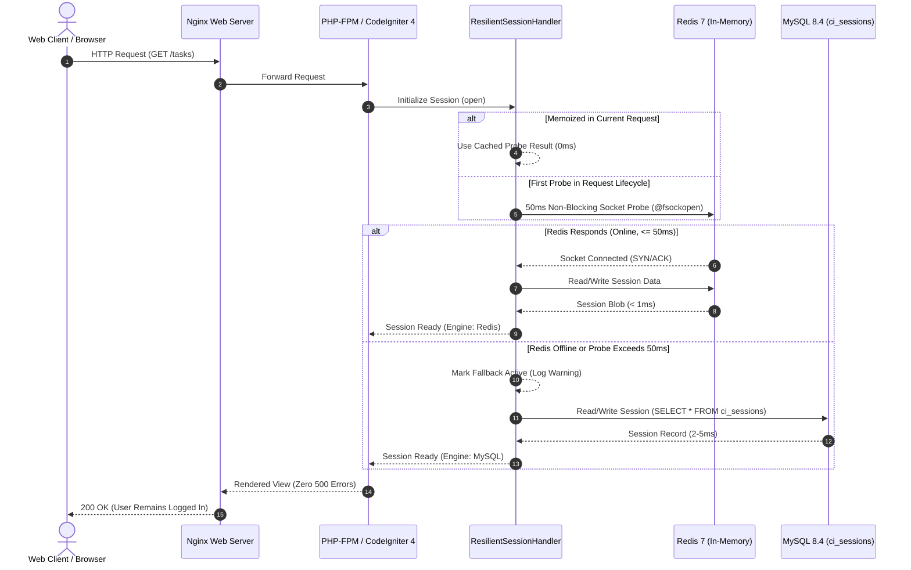

# Dual-Engine High-Availability Fallback & Ecosystem Resilience

This document specifies the fault-tolerant, self-healing **Dual-Engine High-Availability Architecture** implemented in the **AI-Agile-Project-Management-Suite**.

---

## 🎯 Architecture Philosophy

Under standard production operations, performance is paramount:
- Web user sessions, rate-limit state, and application caches execute in-memory via **Redis 7** at sub-millisecond speeds (< 1ms).

However, distributed systems inevitably encounter transient infrastructure faults:
- Redis container restarts, cloud maintenance events, network partitioning, or out-of-memory crashes.

Rather than propagating `500 Internal Server Error` responses, logging out active users, or corrupting state, the suite incorporates a transparent **Dual-Engine Failover System**:
1. **Pre-flight Socket Probe (50ms Ceiling)**: The application inspects Redis socket availability in $\le 50\text{ ms}$ before attempting I/O operations.
2. **Transparent MySQL Session Failover**: If Redis is offline or slow, user sessions silently route to MySQL relational storage (`ci_sessions`).
3. **Transparent File Cache Failover**: Application caches route to local disk storage (`writable/cache/`).
4. **Autonomous Self-Healing**: The moment Redis recovers, the application immediately and silently re-engages in-memory acceleration without service restarts or manual sysadmin intervention.

---

## 📊 Dual-Engine Decision Matrix

| Engine Layer | Primary Driver (Redis Online) | Fallback Driver (Redis Offline) | Destination Storage | Latency Profile |
| :--- | :--- | :--- | :--- | :--- |
| **User Sessions** | `RedisHandler` (In-Memory RAM) | `DatabaseHandler` (MySQL Table) | `tcp://redis:6379` $\to$ `ci_sessions` | $<1\text{ ms}$ (Redis) vs $2\text{--}5\text{ ms}$ (MySQL) |
| **Application Cache** | `RedisHandler` (In-Memory RAM) | `FileHandler` (Local Disk) | Redis RAM $\to$ `writable/cache/` | $<1\text{ ms}$ (Redis) vs $1\text{--}2\text{ ms}$ (File) |
| **Failover Trigger** | Non-blocking Socket Probe | Automatic after 50ms timeout | Memory Switch | Instantaneous ($\le 50\text{ ms}$) |
| **Self-Healing** | Automatic Next HTTP Request | Automatic Probe Verification | RAM Re-engagement | $0\text{s}$ (Zero downtime / Zero restart) |

---

## 🔄 Mermaid Sequence: Resilient Decision Loop



---

## ⚡ Technical Implementation Details

### 1. Ultra-Fast 50ms Pre-Flight Probe & Memoization
In standard implementations, connecting to an unresponsive Redis server triggers PHP default connection timeouts (typically 1,000ms – 2,000ms), introducing noticeable UI lag. 

[`ResilientSessionHandler`](../../services/web/app/Session/Handlers/ResilientSessionHandler.php) eliminates this with:
- **Strict 50ms Socket Probe**: Uses `@fsockopen($host, $port, $errno, $errstr, 0.05)`. If the TCP handshake fails within 50ms, execution drops to MySQL immediately.
- **Request-Lifecycle Static Memoization**: The probe outcome is stored in `private static ?bool $redisAlive`. Subsequent session or cache queries during the same HTTP request execute with 0ms probe overhead.

### 2. MySQL Schema (`ci_sessions`)
Fallback sessions are held in the MySQL relational table created by migration [`2020-12-28-223119_CreateSessionsTable.php`](../../services/web/app/Database/Migrations/2020-12-28-223119_CreateSessionsTable.php):
```sql
CREATE TABLE `ci_sessions` (
    `id` VARCHAR(128) NOT NULL,
    `ip_address` VARCHAR(45) NOT NULL,
    `timestamp` INT(10) UNSIGNED NOT NULL DEFAULT 0,
    `data` BLOB NOT NULL,
    PRIMARY KEY (`id`),
    KEY `timestamp` (`timestamp`)
) ENGINE=InnoDB DEFAULT CHARSET=utf8mb4;
```

### 3. Session Garbage Collection (`php spark session:gc`)
During sustained Redis outages, active sessions accumulate in MySQL. The CLI command [`SessionGc.php`](../../services/web/app/Commands/SessionGc.php) safely prunes expired records:
```bash
# Inside web container
php spark session:gc

# Dry run inspection
php spark session:gc --dry-run
```

### 4. Telemetry & Observability Endpoints
The platform exposes real-time resilience status for infrastructure monitors and load balancers:

- **Public / Container Probe**: `GET /health`
  ```json
  {
      "webapp": {
          "status": "healthy",
          "database_connected": true,
          "active_engine": "redis"
      },
      "resilience": {
          "failover_configured": true,
          "redis_probe_ms": 0.35,
          "redis_status": "connected",
          "session_engine": "redis",
          "cache_engine": "redis",
          "fallback_active": false,
          "timestamp": 1727335600
      }
  }
  ```
  *(If Redis is down, `webapp.status` becomes `"healthy_degraded"`, `redis_status` reports `"fallback_active"`, and `session_engine` switches to `"mysql"`).*

- **SuperAdmin Dashboard**: `GET /admin/telemetry` provides live latency, active client counts, and memory footprint.
- **Top Navigation Banner**: When fallback is active, an alert badge is displayed to administrators:
  `⚠️ Storage Degraded: MySQL Fallback Active`

---

## 🛠 Operational Verification & Simulation

### Scenario A: Testing Normal Operation
```bash
curl -s http://localhost/health | jq .resilience
```
Expected output:
```json
{
  "failover_configured": true,
  "redis_status": "connected",
  "session_engine": "redis",
  "cache_engine": "redis",
  "fallback_active": false
}
```

### Scenario B: Simulating a Redis Outage
```bash
# Stop Redis container
docker compose stop redis

# Verify WebApp continues responding 200 OK
curl -s http://localhost/health | jq .
```
Expected output:
```json
{
  "webapp": {
    "status": "healthy_degraded",
    "database_connected": true,
    "active_engine": "mysql"
  },
  "resilience": {
    "failover_configured": true,
    "redis_status": "fallback_active",
    "session_engine": "mysql",
    "cache_engine": "file",
    "fallback_active": true
  }
}
```

### Scenario C: Self-Healing Recovery
```bash
# Restart Redis container
docker compose start redis

# Query health probe after 2 seconds
curl -s http://localhost/health | jq .resilience.session_engine
# Returns: "redis" (Immediately re-accelerated)
```
