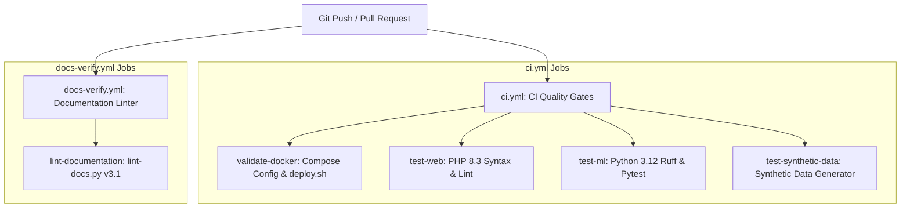

# Continuous Integration & Automated Quality Gates

This document details the Continuous Integration (CI) pipelines maintained in `ci/workflows/`.

---

## 🚀 CI Workflows Overview

The repository defines automated quality gates for CI execution:



---

## 📋 Workflow Details

### 1. `ci.yml` (`ci/workflows/ci.yml`)

1. **`validate-docker`:**
   - Runs `docker compose -f docker-compose.yml config` to catch YAML syntax or service dependency errors.
   - Runs `bash -n scripts/deploy.sh` to ensure bash deployment scripts are syntactically valid.
2. **`test-web`:**
   - Installs PHP 8.3 and required extensions (`intl`, `mbstring`, `mysqli`, `pdo_mysql`, `curl`, `zip`).
   - Lints every PHP file across `services/web/app/` using parallel `php -l`.
3. **`test-ml`:**
   - Installs Python 3.12 and dependencies.
   - Runs `ruff check services/ml/app` for code style and PEP compliance.
   - Executes Pytest unit test suites in `services/ml/tests/unit/`.
4. **`test-synthetic-data`:**
   - Executes dry-run generation with `scripts/generate_synthetic_agile_data.py --count 10`.

---

### 2. `docs-verify.yml` (`ci/workflows/docs-verify.yml`)

1. **`lint-documentation`:**
   - Executes `python3 scripts/lint-docs.py .`
   - Enforces README size ($\le 160$ lines), verifies all relative markdown links, checks Mermaid block closures, and blocks secret or local path leaks.

---

## 🛠 Running CI Checks Locally

Before opening a pull request, run all checks locally:

```bash
# 1. Verify Docker Compose syntax
docker compose config

# 2. Verify deploy script syntax
bash -n scripts/deploy.sh

# 3. Lint documentation
python3 scripts/lint-docs.py .

# 4. Run ML unit tests
docker compose exec ml-chege-jira pytest tests/unit/ -v

# 5. Run WebApp PHPUnit tests
docker compose exec chege-jira ./vendor/bin/phpunit
```
