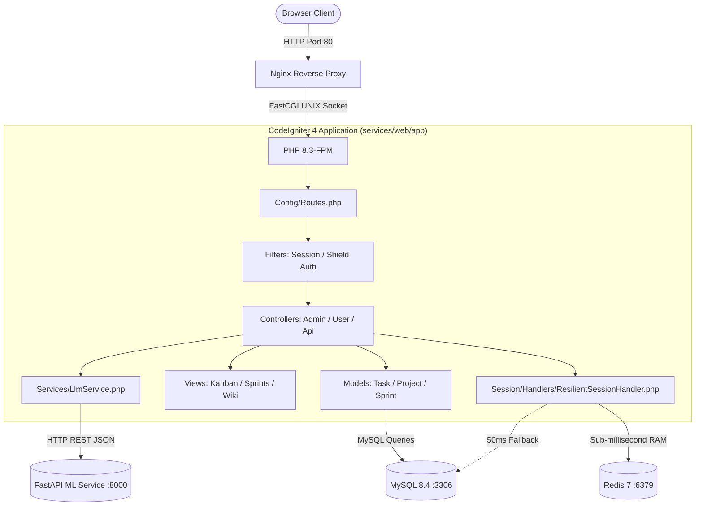

# WebApp Service Overview (CodeIgniter 4)

The **WebApp** service is the primary user-facing component of the suite, built with **PHP 8.3** on the **CodeIgniter 4** framework and served via Nginx and PHP-FPM.

For the comprehensive engineering handbook, CLI commands, and development recipes, see the canonical [CodeIgniter 4 Service Guide](codeigniter.md).

---

## 🏗 High-Level Architecture

The service follows MVC design patterns with strict domain separation:

---

## 🔑 Key Features
- **Agile Sprint & Kanban Engine:** Interactive task cards with drag-and-drop state transitions, backlog grooming, and sprint burndown tracking.
- **Time Tracking & Billing:** Stopwatch timer and manual entry logging with CSV/PDF reporting.
- **Project Wiki:** Markdown-based documentation system with version history and rollback capabilities.
- **Public Client Portal:** Token-gated view allowing external stakeholders to inspect sprint velocity and roadmaps without an account.
- **AI Copilot Integration:** Seamless UI hooks for task enhancement, sprint retrospective generation, and natural-language project Q&A.

---

## 📚 Service Reference Links
- [CodeIgniter 4 Engineering Guide](codeigniter.md)
- [API Contract Specification](../api/contract.md)
- [Dual-Engine Resilience & Failover Architecture](../architecture/resilience-and-failover.md)
- [Local Development Workflow](../engineering/local-development.md)
